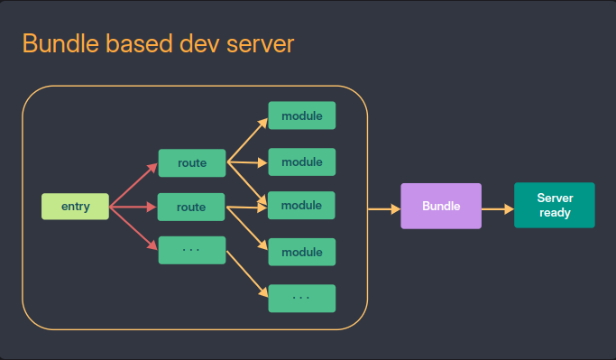
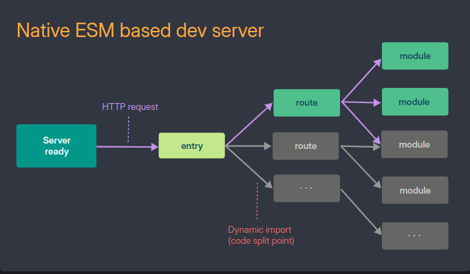

# 概述 Vite

在 2020 年，Web 建置工具還是 Webpack 的天下，但其繁雜的配置和緩慢的建置速度極大地拖累了開發體驗。當 Vite 的出現，以其卓越的速度和直覺易用的配置，以及強調開發體驗優先的設計哲學，刷新了人們對 Web 構建工具的認知。讓許多人，包括我自己毫不猶豫地選擇 Vite 作為專案的建構工具，即使到今天，Vite 仍是「最容易使用」的建構工具沒有之一。

## Vite 核心組件

Vite 主要由兩個組件構成：

- 開發伺服器（dev server）：透過[原生 ES 模組](https://developer.mozilla.org/en-US/docs/Web/JavaScript/Guide/Modules)提供源文件，並[內建豐富的功能](https://vitejs.dev/guide/features.html)，擁有令人驚艷的快速熱模塊替換（HMR）。
- 建構工具（build tool）：將程式碼透過 Rollup 捆綁，並提供預設配置以輸出高度最佳化的靜態資源用於生產環境。

## ECMAScript Modules

早期瀏覽器並沒有原生的模組機制，因此出現了各種標準，如 CommonJS、AMD 或 UMD。但在 ES6 之後情況有了改變。ES6 規範中引入了模組概念（ECMAScript Modules，簡稱 ESM），允許使用 import 和 export 語法。現在所有[主流瀏覽器都支持 ESM](https://caniuse.com/?search=esm)，只需在 `<script>` 標籤中添加 `type="module"`，瀏覽器就能處理腳本中的 import 和 export。ES 模組的加載方式是先查看所有的導入路徑，並僅下載和執行每個模組一次。

## 傳統建構工具的性能挑戰

傳統的建構工具（如 Webpack）旨在將專案的原始碼與相依套件打包在一起。儘管在寫程式時使用 import 和 export，但在輸出時可能已被 Babel 或 Webpack 轉換成 CommonJS 或其他形式。這也是 Webpack 等打包工具速度較慢的原因：它們需要靜態分析專案中所有文件及依賴，然後根據這些資訊進行打包，隨著檔案增多，所需時間自然也會增加。

## Vite 的打包原理與性能挑戰

Vite 利用瀏覽器原生支援的 ESM，避開了傳統打包過程，使原始碼模組在開發階段由瀏覽器直接處理載入，提升了開發時的效能。然而[在生產環境中，Vite 仍然採用傳統打包策略，通過 Rollup 生成最終的發布版本](https://vitejs.dev/guide/why.html#why-bundle-for-production)。這是因為使用原生 ESM 導入模組可能導致「瀑布式」的網路請求，尤其在大型專案中，模組的多層 import 會增加請求次數，從而影響頁面載入速度，這種問題在大型專案的開發期間也會放大，導致較差的頁面載入速度。

