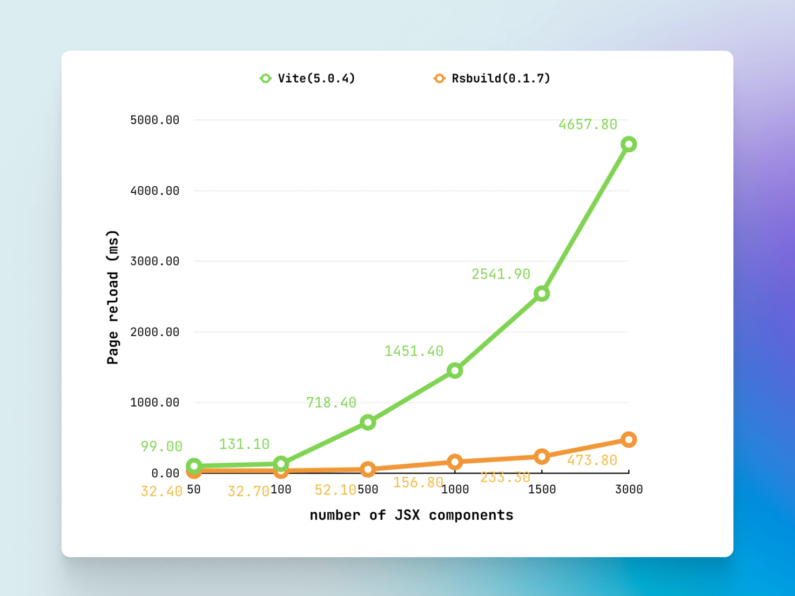

## Vite 的瓶頸

隨著專案規模的擴大，Vite 所使用的機制所造成的瓶頸也逐漸顯現出來，主要有以下兩個問題：

### 1. 開發環境、生產環境建構機制不一致

第一個問題是老生常談的問題了，雖然出現頻率不高但一旦出現就會很讓人頭疼，因為很難排查原因，我們可以看到即使在現在還是有不少 issues 是關於這個問題的。不過由於 Vite 承諾之後會用 Rolldown 來徹底解決這類問題，所以在此我們不做過多的討論。

### 2. 大型專案開發期間頁面刷新緩慢

真正導致大型專案不得不從 Vite 遷移到 Rspack 的原因，是開發期間的頁面加載速度，也是 Vite 做為建構工具的開發體驗瓶頸。隨著專案檔案增多，Vite 頁面載入速度會越來越慢，尤其在開發期間打開瀏覽器的 DevTools，使用 DevTools 時導致頁面需要載入 10 秒以上，這對於開發體驗來說是很難接受的。

注意這裡說的是開發期間 (vite dev) 的頁面載入速度，不是專案打包 (vite build) 後的頁面載入速度。Vite 的瓶頸並不是 HMR（頁面熱重載）或 Vite 編譯速度過慢，這兩者 Vite 已經夠快了。

頁面重載速度的瓶頸是來自於 Vite 開發伺服器的底層設計，因為利用瀏覽器原生支援的 ESM，直接把 ES 模組直接送到瀏覽器的機制，因此避開了傳統打包過程，卻也導致了「瀑布式」的網路請求，尤其在大型專案中，模組的多層 import 會增加請求次數，從而影響頁面載入速度。意味著即使在未來 Vite 實裝了 Rolldown 這個問題也不會得到解決。

其實該問題困擾著許多人：[《Page reload very slow, unbundle DX for large web app is not satisfactory》](https://github.com/vitejs/vite/discussions/13697)，不知什麼原因（或許是因為 Vite 核心團隊較少面對大型專案？），這個問題一直無法重視，他們好像更關心的是啟動速度、HRM 速度，但對於開發較大的項目來說，頁面刷新速度（重載速度）是一個非常重要的問題，而 Vite 的最大的瓶頸就在與此。因此遷移到 Rspack 可能是一個解決這些問題的有效方法。

## Rspack 的優勢

### 1. 更快的頁面載入速度

不僅是由於 Rspack 的建置速度快，更重要的是 Rspack 的建置機制不會導致頁面請求數過多，這是因為 Rspack 會把所有的來源文件打包成少數幾個文件，然後再送到瀏覽器，這樣就避開了瀏覽器載入的瓶頸。

### 2. 開發環境與生產環境一致

不僅是因為 Rspack 沒有採用 Vite 那種開發環境和生產環境不一致的建構機制，Rspack 驚人的速度也讓我們可以在開發環境中使用與生產環境一樣的編譯配置。在過去的建置工具裡，為了開發環境的速度，有些配置往往只用在生產環境，例如程式碼相容性轉義。例如只在生產環境打包時才使用 @vitejs/plugin-legacy 進行轉義。而 Rspack 夠快，可以讓開發環境使用和生產環境完全一樣的配置，得到完全一樣的建置結果，也不用擔心速度問題。

### 3. 令人驚艷的打包速度

切換到 Rspack 後一個令人驚訝的地方是打包速度，當專案打包度提升，這意味著更快的迭代、更快的上線，這對團隊來說是非常重要的。或許有人會質疑，幾十秒的打包速度提升真的能影響開發體驗嗎？其實，這裡真正的關鍵在於：當打包速度快到一定程度（例如幾秒鐘內完成），你的開發流程將變得更加流暢，不會因為等待打包而頻繁中斷。這種無縫銜接的開發體驗，不僅提升了工作效率，也讓整個團隊的工作氛圍更加輕鬆愉快。

|                                      | [Vite](https://vitejs.dev/) | [Rsbuild](https://rsbuild.dev/) |
| ------------------------------------ | --------------------------- | ------------------------------- |
| Build Time(time npm run build)       | 43.72s                      | 13.17s `-70%`                   |
| Bundle Size(du -hs ./dist)           | 147M                        | 111M `-25%`                     |
| Dev mode startup(first loading time) |                             |                                 |

### 4. Webpack 生態相容性

Rspack 另一個優點是它的 Webpack 生態相容性，Rspack 可以相容於 Webpack 的大部分插件。對於一個新的 Web 專案來說可能用不到，因為 Vite 生態大多都有對應的插件，不過像是 Figma 插件和 Sketch 插件，由於它們的官方構建支持都是基於 Webpack 的，而用 Rspack 可以幾乎無縫的替代 Webpack ，在繼續沿用現有的開發工具的同時，享受它帶來的高效構建體驗。

## 總結

遷移到 Rspack 顯著改善了開發體驗，解決了 Vite 的頁面加載速度限制，並提供了更快的構建時間。開發流程將變得更加流暢，不會因為等待建置而頻繁中斷。

### Rspack 和 Rsbuild 的區別

原本使用 Webpack 的項目，可以直接遷移到 Rspack；而對尚未使用 Webpack 的項目，使用 Rsbuild 可能會提供更簡化的配置體驗，Rspack 為了兼容 Webpack ，配置和 Webpack 一樣繁雜，而 Rsbuild 則是提供更精簡的配置結構，並為 Rspack 提供預設功能的組件，體驗更接近 Vite 的使用感受。
