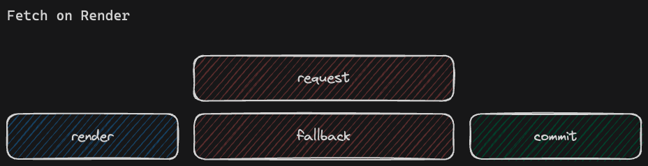
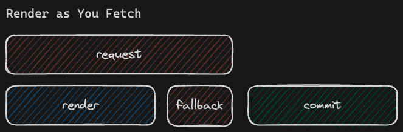
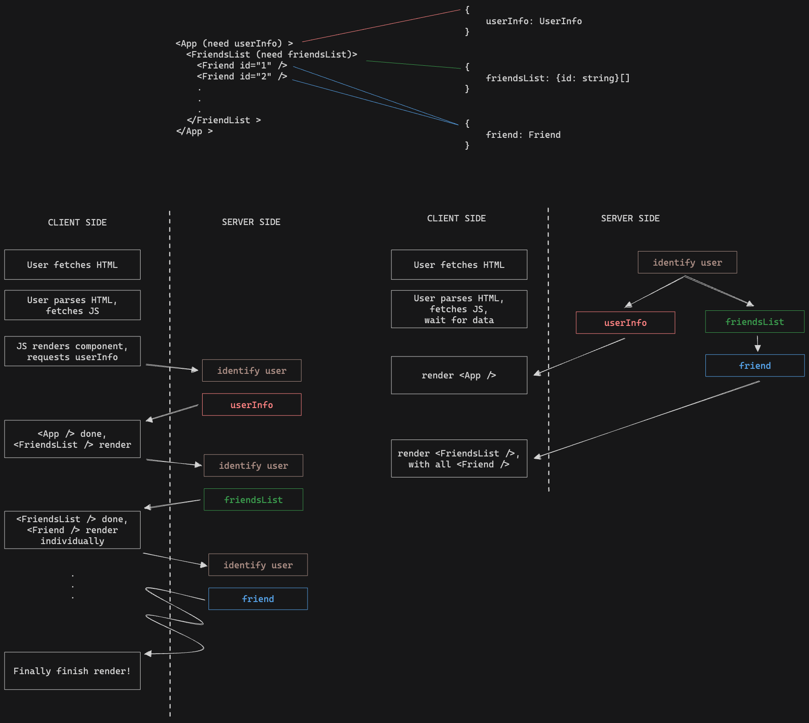

在 React 19 RC 發布後，Suspense 行為的改變引發了大量討論，焦點聚焦在 Fetch on Render 和 Render as You Fetch 之間的比較以及執行資源請求時機的最佳實踐。本文將詳細探討這些變化，並說明為何應該避免在渲染時進行資料請求。

## Suspense 行為的變化

在開始分析 Fetch on Render 和 Render as You Fetch 之前，我們先來聊聊 Suspense 的行為，以及它如何影響資源請求的時機。

### React 19 前

過去 React 會同時渲染 Suspense 邊界下的所有同級元素，並在所有 Promise 解決前顯示指定的 Fallback 元素。這種行為類似於 Promise.all，等待所有並行的非同步任務完成後才更新 UI，因此 Suspense 邊界內的所有元素會同時觸發內部請求，形成並行的資源請求模式。

### React 19 後

新的行為會按順序渲染 Suspense 邊界下的所有同級元素。React 現在採用「瀑布式」方法來執行非同步任務，使得 Fallback 元素能更快顯示。這種行為類似於 for await...of 循環，按順序渲染每個元素，並在各自的 Promise 解決後依次更新 UI，因此 Suspense 邊界內的所有元素會依序觸發內部請求，形成瀑布式的資源請求模式。

從 React 核心團隊的角度來看，這是一個微不足道的改變，因為客戶端上的 `Suspense` 行為被標記為實驗性，未正式發佈。但是對於 React 生態系中的大型函式庫，如 React Query 和 React-three-fiber 已經依賴其舊有行為，許多早期採納者也是如此，因此引發了強烈的爭議。

## Fetch on Render 的核心問題

激烈的討論中，React 核心團隊解釋了行為改變的理由：在 `Suspense` 邊界下的個別元件中執行資源獲取（即所謂的 fetch-on-render 模式）是一種 Bad Practice。

### Fetch on Render 的問題所在

在渲染時觸發資源獲取會導致效率低下，原因如下：

1. 等待 HTML 載入
2. 解析 HTML 並等待 JavaScript 載入
3. 解析 JavaScript
4. JavaScript 渲染該元件
5. 觸發 API 請求
6. 丟棄首次渲染結果
7. 顯示元件的 Fallback 元素
8. 等待 API 請求完成
9. 重新渲染該元件

API 請求只在元件渲染後才會觸發，以獲取所需的資料。這種方式存在兩個問題：首先，資源獲取涉及多次往返，延遲了實際內容的渲染，當某個元素的資源請求依賴另一個元素時，情況將會更糟，形成瀑布式的請求。其次，用於觸發資源請求的渲染結果會被丟棄。若是個 computation-heavy 的元素來說，既浪費計算資源，又無法得到有意義的結果。

## 最佳實作：Render as You Fetch

為了解決上述問題，React 核心團隊推薦了一種實作方法：Render as You Fetch。這種方法的核心思想是在元件外預先獲取所需資源。儘管 React 的心智模型強調「元件組合」（Component Composition）—— 即元件應封裝所有必要元素，包括狀態、邏輯和視圖，但在實際應用中，僅依賴元件封裝並不足以作為複雜應用程式的唯一模型。

### Render as You Fetch 的工作原理

- 提前進行資料的請求（hoisting your data requirements）
- 元件只作為資源使用者（Data Consumer）

事先發起資源請求，因此當 React 開始渲染 `Suspense` 子元件時，不論是渲染到第幾個元件，它都不會觸發新的請求，而是會使用已經在執行的 Promise，而不是自己發起 Promise。提前資料的請求，可以透過路由載入器（route loaders）或伺服器元件（server components）來實現。

## 結論

React 19 中 `Suspense` 行為的改變，強調優化資源獲取策略的重要性。雖然 Fetch on Render 符合元件封裝的理念，但它帶來的是顯著的性能問題。採用 Render as You Fetch 確保了更高效的渲染過程，通過減少顯示內容的延遲來改善用戶體驗。
